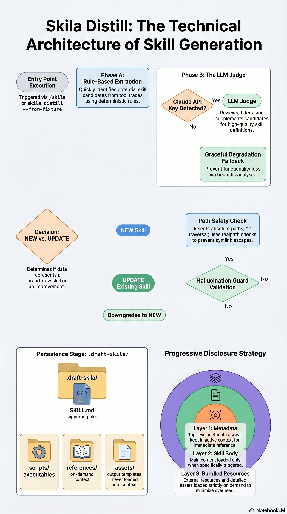
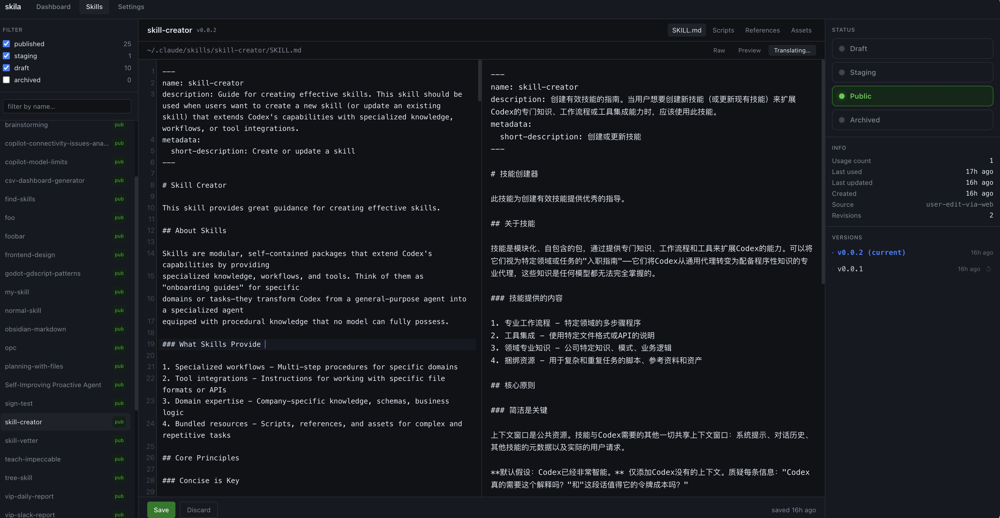

<div align="center">

# skila

**Self-improving skill manager for Claude Code**

Automatically distill coding sessions into reusable, versioned skills — complete with scripts, references, and assets.

[English](#english) | [中文](#中文)

</div>

---

## English

### Install

```sh
# npm (global CLI)
npm i -g @luyao618/skila

# Claude Code plugin
/plugin marketplace add luyao618/skila
/plugin install skila@skila

# MCP server
npx -y @luyao618/skila mcp
```

### Quick start

```sh
/skila                         # inside Claude Code — distill current session
skila serve                    # web control panel at http://127.0.0.1:7777
skila list                     # list skills by status
skila inspect <name>           # view a skill
```

### How it works

`/skila` or `skila distill` turns a Claude Code session into a complete skill directory — automatically.

<p align="center">
  
</p>

The pipeline has three stages:

1. **Rule-based extraction** — scans tool traces for reusable artifacts. Repeated/complex Bash → `scripts/`, read docs → `references/`, written templates → `assets/`.
2. **LLM Judge** — decides **NEW** or **UPDATE** against existing inventory. Filters and supplements extracted files. Falls back to heuristic matching when no API key is available.
3. **Write + validate** — outputs a spec-compliant skill directory with hallucination guards and path safety checks.

### Web control panel

`skila serve` launches a three-pane Obsidian-style dashboard:

<p align="center">
  
</p>

- **Skill editor** — CodeMirror 6 markdown editor with raw / preview / translate views
- **LLM translation** — translate skills to any language via streaming SSE (Claude API)
- **Version control** — browse version history, rollback to any previous version
- **Lifecycle management** — filter and transition skills across statuses: draft → staging → published → archived / disabled
- **Feedback inspector** — success rate, usage count, invocation history

### License

MIT © yao 2026

---

## 中文

### 安装

```sh
# npm 全局安装
npm i -g @luyao618/skila

# Claude Code 插件
/plugin marketplace add luyao618/skila
/plugin install skila@skila

# MCP 服务器
npx -y @luyao618/skila mcp
```

### 快速开始

```sh
/skila                         # 在 Claude Code 中一键提炼当前会话
skila serve                    # 打开 Web 控制面板 http://127.0.0.1:7777
skila list                     # 按状态列出所有 skill
skila inspect <name>           # 查看 skill 内容
```

### 工作原理

`/skila` 或 `skila distill` 将 Claude Code 会话自动转化为完整的 skill 目录。

<p align="center">
  
</p>

流程分三个阶段：

1. **规则提取** — 扫描工具调用记录，提取可复用产物。重复/复杂的 Bash 命令 → `scripts/`，读取的文档 → `references/`，写入的模板 → `assets/`。
2. **LLM 审核** — 对比现有 skill 库，判断**新建**还是**更新**。过滤和补充提取的文件。无 API Key 时自动降级为启发式匹配。
3. **写入 + 验证** — 输出符合规范的 skill 目录，内置幻觉防护和路径安全检查。

### Web 控制面板

`skila serve` 启动三栏 Obsidian 风格的管理面板：

<p align="center">
  
</p>

- **Skill 编辑器** — CodeMirror 6 Markdown 编辑器，支持原文 / 预览 / 翻译视图
- **LLM 翻译** — 通过 Claude API 流式翻译 skill 到任意语言
- **版本控制** — 浏览版本历史，回滚到任意历史版本
- **生命周期管理** — 按状态筛选和流转 skill：draft → staging → published → archived / disabled
- **反馈面板** — 成功率、使用次数、调用历史

### 许可证

MIT © yao 2026
