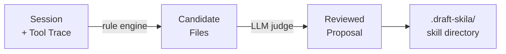
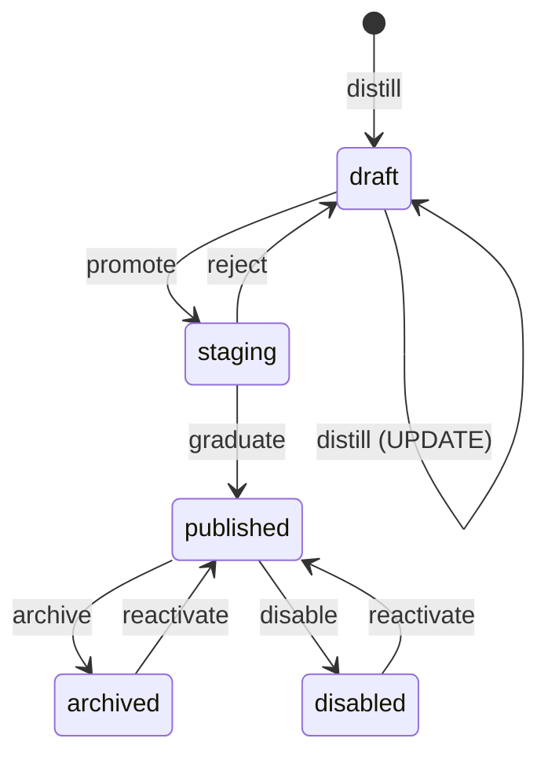

# skila

Self-improving skill inventory controller for Claude Code: distill sessions into versioned skills, evolve them via feedback, and manage everything from a local web control panel.

> **Status: Phase 2 (functional).** Distill, lifecycle commands, feedback loop, web control panel, and MCP transport are implemented. Supporting files (scripts/references/assets) auto-generation is live.

## Install

### npm (global CLI)

```sh
npm i -g @luyao618/skila
skila --help
```

### Claude Code plugin marketplace

```sh
/plugin marketplace add luyao618/skila
/plugin install skila@skila
```

The plugin auto-registers the `/skila` slash command plus PostToolUse + Stop hooks for feedback collection — zero post-install configuration.

### Smithery (MCP)

```sh
npx -y @luyao618/skila mcp
```

Smithery deploys it as an ephemeral, read-only MCP server (mutation commands are disabled in this transport — see Decision D5 in the implementation plan).

## Quick start

```sh
# inside Claude Code
/skila                         # distill the current session into NEW/UPDATE proposals

# from a terminal
skila serve                    # open the web control panel on http://127.0.0.1:7777
skila list                     # list skills grouped by status
skila inspect <name>           # show a skill (optionally --version v0.X.Y)
skila install-hooks            # (npm -g installs) merge PostToolUse+Stop hooks into ~/.claude/settings.json
```

## How it works

### Skill generation (distill)

When you run `skila distill`, the pipeline turns a Claude Code session into a complete, spec-compliant skill directory:



**Three phases:**

1. **Rule-based extraction** — scans the tool trace for reusable artifacts: repeated/complex Bash commands → `scripts/`, read docs → `references/`, written templates → `assets/`. Each candidate gets a confidence score.
2. **LLM Judge** — reviews the candidates against the existing skill inventory. Decides **NEW** (no similar skill exists) or **UPDATE** (merge into existing skill with version bump). Also filters, reclassifies, and supplements the extracted files per Claude Code skill conventions.
3. **Write + validate** — writes SKILL.md (with `## Bundled Resources` references), `.skila.json` sidecar, and all supporting files. Validates the result against the skill-creator spec (≤500 lines, correct subdirectories, no orphan files).

Hallucination guard: if the judge proposes UPDATE → a skill that doesn't exist in inventory, the decision is automatically downgraded to NEW with a structured warning.

**Generated directory structure:**

```
.draft-skila/my-skill/
├── SKILL.md              # frontmatter + instructions + bundled resource refs
├── .skila.json           # version, status, changelog (kept out of SKILL.md)
├── scripts/              # deterministic executable code
│   └── deploy.sh
├── references/           # docs loaded into context on demand
│   └── api-reference.md
└── assets/               # templates/icons copied to output, never loaded
    └── boilerplate.html
```

### Skill lifecycle



| Transition | Command | What happens |
|---|---|---|
| **NEW skill** | `skila distill` | Extracts session → writes to `.draft-skila/` |
| **UPDATE skill** | `skila distill` | Judge matches existing skill → bumps version |
| **Promote** | `skila promote <name>` | draft → staging (ready for review) |
| **Graduate** | `skila graduate <name>` | staging → published (Claude Code loads it) |
| **Feedback loop** | `skila feedback <name>` | Records success/failure, drives future improvements |

### Progressive disclosure (3-layer loading)

Skila follows Claude Code's progressive disclosure model to minimize context window usage:

| Layer | What | When loaded | Size target |
|---|---|---|---|
| **Metadata** | name + description | Always in context | ~100 words |
| **SKILL.md body** | Instructions | When skill is triggered | <5k words |
| **Bundled resources** | scripts/ references/ assets/ | When referenced in body | As needed |

## Web control panel

`skila serve` starts a single-file UI on `127.0.0.1:7777` (auto-increments on conflict). Three-pane Obsidian-style workspace: sidebar (filter / search / skills) → center (CodeMirror 6 SKILL.md editor) → inspector (versions / feedback / actions).

> Screenshot placeholder — captured during Phase 3 visual gate (AC18 ≥ 7/10).

## License

MIT © yao 2026
