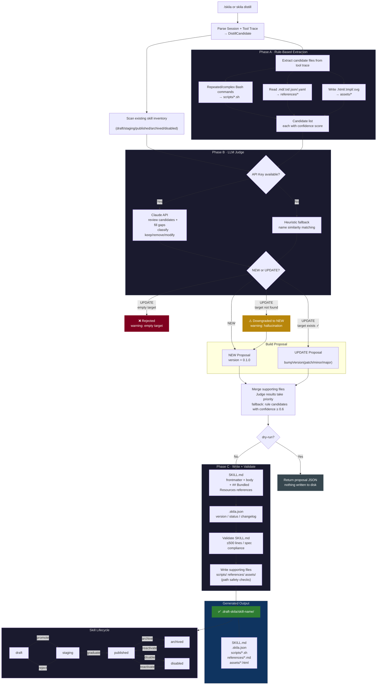

# Skila Distill: Skill Generation & Update Pipeline

> Entry point: `/skila` in Claude Code, or `skila distill --from-fixture <session.md>` from terminal

## Unified Flow

## Key Design Decisions

| Mechanism | Description |
|---|---|
| **Two-phase extraction** | Phase A uses rules to quickly extract candidates from tool traces; Phase B uses LLM to review, filter, and supplement |
| **Hallucination guard** | Judge says UPDATE but target is empty → reject; target doesn't exist → downgrade to NEW |
| **Path safety** | Pre-write validation: reject `..`, absolute paths, invalid subdirectories; realpath check prevents symlink escape |
| **Progressive disclosure** | Layer 1 metadata always in context → Layer 2 body loaded on trigger → Layer 3 bundled resources loaded on demand |
| **Graceful degradation** | No Claude API key → automatic fallback to heuristic judge, no functionality loss |
| **Supporting file classification** | `scripts/` deterministic executable code · `references/` on-demand context docs · `assets/` output templates (never loaded into context) |
